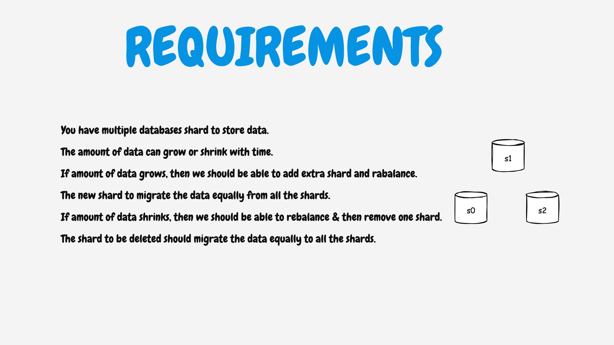
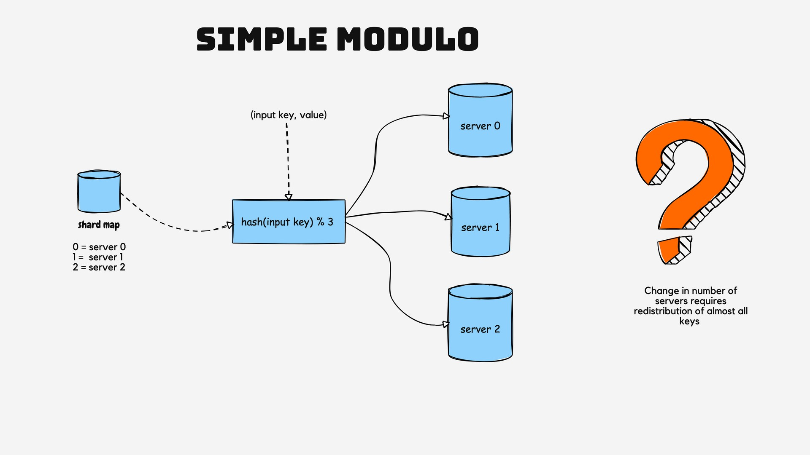
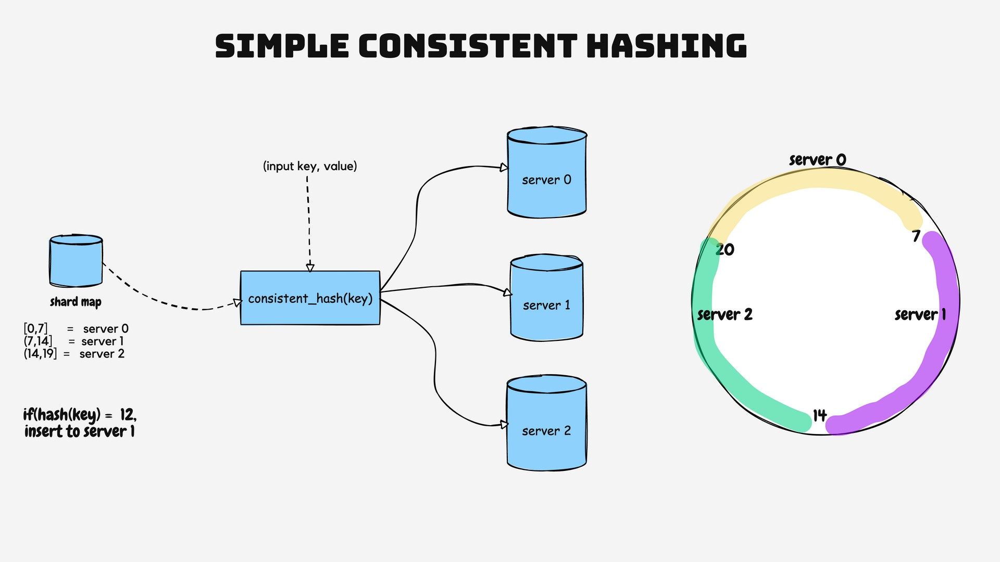
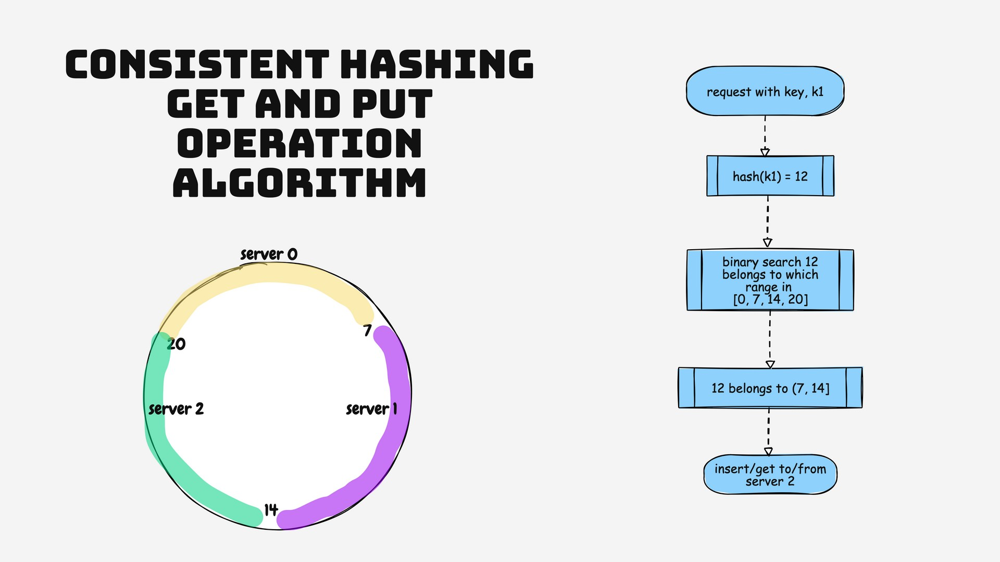
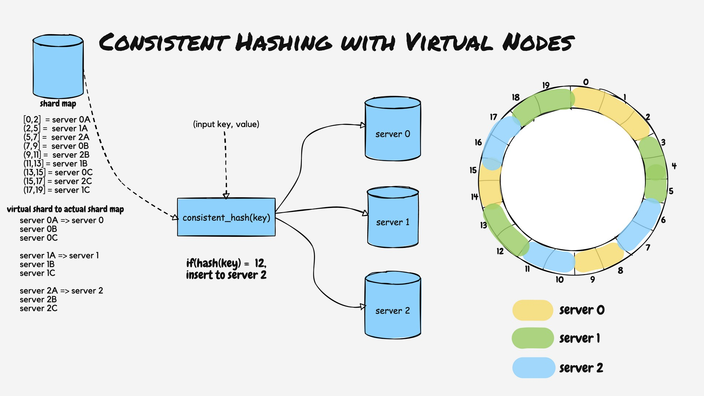

## Consistent Hashing
This helps you understand the concept of consistent hashing with Virtual nodes.  

Here is the detail on consistent Hashing 

#### Requirement

#### Problem with simple modulo

#### Simple consistent Hashing

#### Algo

#### Final Approach

### To do
1. While re-balancing is happening the db is un usable.
2. Only shard addition is handled here. Shard deletion is to be done.

